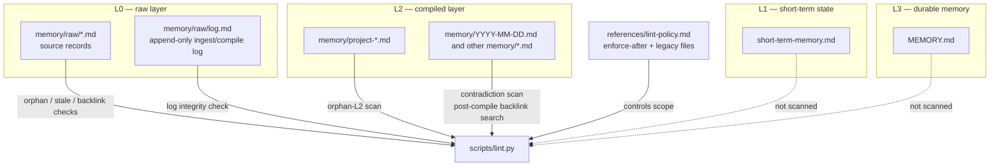
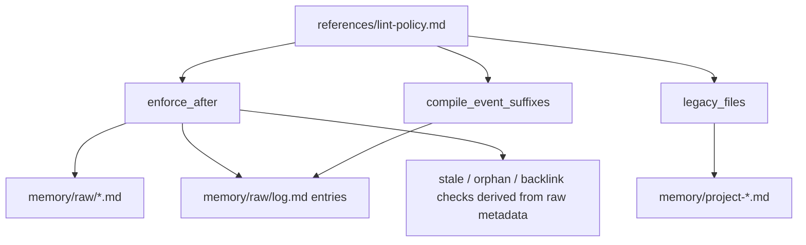
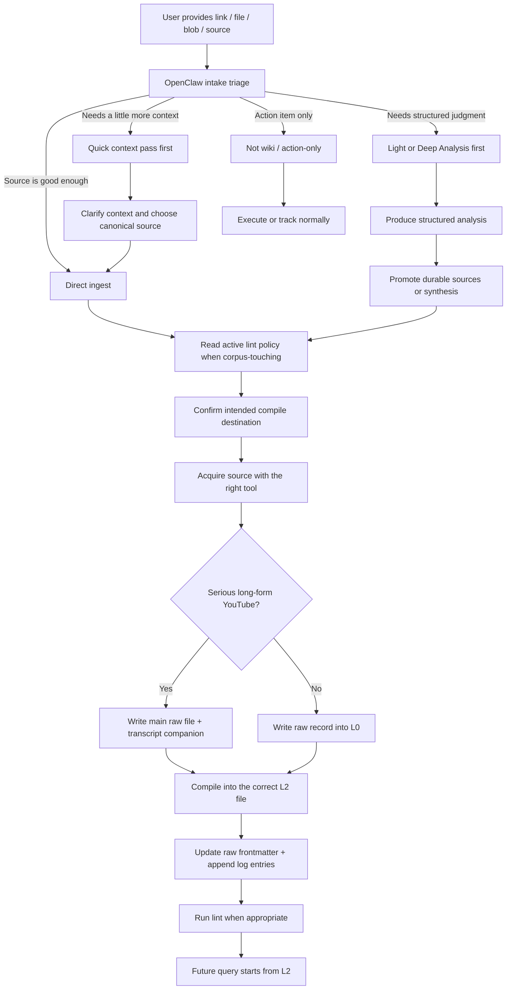
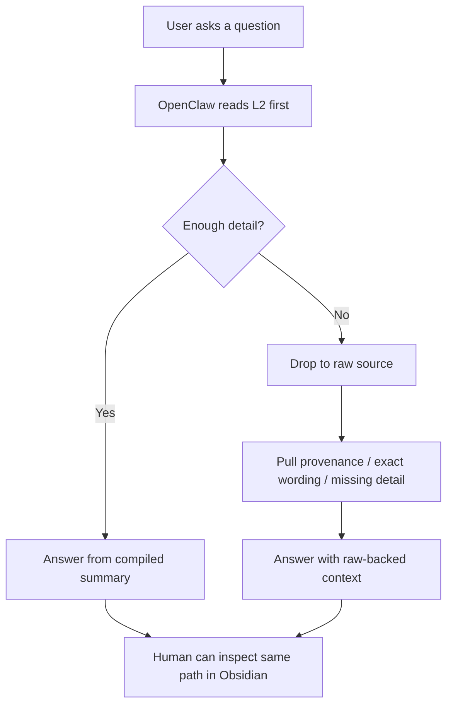

# llm-wiki

A markdown-first knowledge base pattern built around **OpenClaw** as the runtime and **Obsidian** as the human-facing read layer.

This repo is intentionally small. It is **not** a standalone app or vector database. It is:
- a workflow/spec for how a long-lived markdown knowledge base should operate
- a public `SKILL.md` for agent runtimes
- one useful integrity tool: `scripts/lint.py`
- a few reference files for routing, compile conventions, and lint policy

The goal is simple: **make knowledge compound over time instead of re-deriving everything from raw documents on every query.**

> Further OpenClaw background: if you want the broader design context behind this setup, read Jo's OpenClaw guide here — https://github.com/johanesalxd/random-stuff/blob/main/others/openclaw/openclaw-public-guide.md

---

## What this system assumes

This repo reflects a working setup where:
- **OpenClaw** handles ingestion, orchestration, and query
- **Obsidian** is a read-only human mirror for browsing the knowledge base
- the knowledge base itself is a set of layered markdown files

The architecture is not secret or proprietary. The local/private deployment may have different paths and workspace-specific conventions, but the core operating model is public and reusable.

---

## Reference

This repo is inspired by:
- Andrej Karpathy, *A pattern for building personal knowledge bases using LLMs*
- https://gist.github.com/karpathy/442a6bf555914893e9891c11519de94f

---

## Tiered memory architecture

This repo adds an **L0 raw-source layer** on top of the broader OpenClaw workspace memory model described in the OpenClaw public guide. That is why this README starts at L0 while the broader workspace guide usually starts at L1.

The system uses a four-layer markdown memory stack.

```text
L0  memory/raw/           immutable source records
L1  short-term-memory.md  active working state / session tracking
L2  memory/               compiled project files, dated notes, and indexes
L3  MEMORY.md             curated durable memory
```

### L0 — Raw sources
Raw records preserve source fidelity.

Examples:
- articles fetched from the web
- PDF extraction output
- image-analysis output
- YouTube source shell + transcript companion
- X/Twitter thread captures

This is the layer you fall back to when you need:
- original wording
- provenance
- missing detail
- contradiction checks

### L1 — Short-term memory
Short-term memory is the active working layer.

It tracks:
- open fronts
- in-progress tasks
- session-level active state

This is not the main llm-wiki knowledge substrate. It is the current working scratchpad and session/state tracker.

### L2 — Compiled knowledge
This is the main reading and query surface.

Examples:
- `memory/project-*.md`
- `memory/YYYY-MM-DD.md`
- `memory/projects.md`

Most useful answers should come from here first.

### L3 — Curated durables
This is the smallest, highest-signal layer.

It holds:
- durable lessons
- long-lived decisions
- preferences and stable operating constraints

In an OpenClaw setup, `MEMORY.md` is a built-in durable memory surface.

### What `lint.py` scans

The linter does **not** scan every markdown file equally. It focuses on the raw layer, the compile layer, and the append-only log.



In practical terms:
- **Scanned directly:** `memory/raw/*.md`, `memory/raw/log.md`, `memory/project-*.md`, and other `memory/*.md` files used for contradiction/backlink checks
- **Used as policy, not lint target:** `references/lint-policy.md`
- **Not scanned as wiki-health targets:** `short-term-memory.md` and `MEMORY.md`

A few important details:
- `memory/raw/log.md` is checked separately from raw source files
- `memory/project-*.md` is the main target for orphan-L2 detection
- dated memory files (`memory/YYYY-MM-DD.md`) are not used for orphan-L2, but they are still searched for contradiction flags and raw backlinks
- `MEMORY.md` is intentionally excluded because it is curated durable memory, not part of the compiled-source backlink discipline

### How lint policy is enforced

A new adopter usually has **two policy knobs** to set in `references/lint-policy.md`.

| Policy key | Where to change it | What it controls | Typical use |
|---|---|---|---|
| `enforce_after` | `references/lint-policy.md` | Date-based enforcement for raw files, raw log entries, and raw-derived checks | "Start strict llm-wiki enforcement from 2026-06-01." |
| `legacy_files` | `references/lint-policy.md` | Project files that should be treated as migration backlog instead of current lint debt | "My old `project-research.md` predates wiki discipline; keep it legacy for now." |
| `compile_event_suffixes` | `references/lint-policy.md` | Valid compile-log suffixes that describe follow-on compile events rather than distinct raw filenames | "We use `-second-pass` for transcript-driven recompiles." |



Plain-English rule:
- use **`enforce_after`** for artifacts that already carry semantic dates (`date_ingested`, `compiled_date`, filename date, or log-entry date)
- use **`legacy_files`** for pre-existing `project-*.md` files that should stay in migration backlog until you intentionally modernize them
- use **`compile_event_suffixes`** only if your compile log includes follow-on events like `-second-pass`
- if you leave `compile_event_suffixes` empty, the linter assumes **no** special compile-event suffixes at all

One subtle but important point:
- **`project-*.md` files are not date-gated as whole files**
- instead, they are governed by migration policy (`legacy_files`) plus structural backlink boundaries inside the file

So for a new deployment, the normal setup is:
1. pick an `enforce_after` date
2. list any older project files under `legacy_files`
3. start ingesting and compiling new sources under the new date boundary
4. let old corpus remain backlog until you decide to clean it up

---

## OpenClaw + Obsidian roles

The same knowledge base is accessed in two different ways.

### OpenClaw
OpenClaw is the runtime.

It plays three roles:
1. **Point of ingestion**
   - receives URLs, files, blobs, and references
2. **Orchestrator**
   - chooses the right acquisition tool
   - writes raw records
   - compiles useful summaries into the wiki
   - runs lint when needed
3. **Query engine**
   - answers against the compiled markdown substrate
   - falls back to raw sources only when necessary

### Obsidian
Obsidian is the human-facing read layer.

Use it to:
- browse project notes
- read dated notes
- inspect raw sources manually
- navigate the knowledge base as markdown

Obsidian is **not** the canonical store and does not drive ingest logic. It is a read-only mirror / consumption layer.

---

## Human view vs agent view

### Human / Obsidian view
A human usually experiences the system like this:
1. open Obsidian
2. read a project file or dated note
3. if needed, drill down into the raw source

### Agent / OpenClaw view
The agent should usually do this instead:
1. start from the compiled layer first
2. answer from project files / dated notes / indexes when sufficient
3. drop into raw only for provenance, exact wording, or missing detail

That asymmetry is intentional.

---

## Ingestion flow: source to query

This is the normal path when a human drops a source into the system.



### Plain-English version
1. **Source arrives**
   - article, PDF, image, YouTube link, X thread, notebook reference, etc.
2. **OpenClaw triages it**
   - direct ingest
   - quick context pass
   - light analysis first
   - deep analysis first
   - or not-wiki / action-only
3. **If the work touches an existing corpus, read the active lint policy first**
4. **Confirm the intended compile destination before writing anything**
5. **OpenClaw acquires usable content**
6. **L0 raw record is written**
   - for serious long-form YouTube, this is usually **two raw files**:
     - main raw source
     - transcript companion
7. **L2 compiled notes are updated**
8. **Raw bookkeeping is updated**
   - frontmatter: `compiled`, `compiled_date`, `compiled_into`
   - append-only `memory/raw/log.md`
9. **Lint runs when appropriate**
   - batch
   - refactor
   - integrity check
   - not as a ritual after every single ingest
10. **Future query starts from the compiled layer**

---

## Query flow: question to summary to raw

This is the reverse path when a human asks a question later.



### Plain-English version
1. question arrives
2. OpenClaw reads compiled notes first
3. if that is enough, answer from L2
4. if not, fall back to L0 raw sources
5. human can inspect the same markdown trail in Obsidian

---

## YouTube special case

YouTube is the main place where a two-file raw pattern helps, and for **serious long-form videos** it should be treated as the default path.

When transcript/captions are available, preserve **two raw files**:

### 1. Main raw source file
This keeps the canonical shell:
- title
- source URL
- source description
- chapter map / metadata
- acquisition notes
- pointer to transcript companion

### 2. Transcript companion file
This keeps the full-fidelity text:
- full transcript / captions
- backlink to the main raw source

Why split it?
- the main file stays readable in Obsidian
- the transcript remains available for deep query / later recompilation
- long-form videos stop being “chapter map only” stubs
- the transcript becomes the canonical compile source instead of a helper summary

In the OpenClaw-shaped layout used here, those files live under `memory/raw/`.

One more operational nuance: if the same canonical video is intentionally re-run under a **new policy boundary**, it is acceptable to create fresh raw/log artifacts on the new date. The thing that must stay clean is the **compile destination**, not artificial deduplication across all time.

---

## Analysis surfaces used in practice

This system is not just ingest + query. Sometimes a source needs extra judgment before it should enter the wiki.

### Search
Use search when current context is incomplete and the right source still needs to be found or compared.

Common examples in an OpenClaw setup:
- `web_search`
- `web_fetch`
- `firecrawl`
- repo-specific helpers such as `gemini-search` when used as an external helper (for example: `https://github.com/johanesalxd/gemini-search`)

### Light Analysis
A lighter structured pass before persistence.

Use it when:
- the source/topic needs quick framing
- there are multiple candidate sources
- a little judgment is needed before ingesting

### Deep Analysis
A heavier structured pass before persistence.

Use it when:
- the topic is strategic
- the source is contested or ambiguous
- you want a stronger synthesis before promoting anything into the wiki

In a real OpenClaw deployment, these analysis modes are wrappers around existing acquisition and reasoning tools — not separate storage systems.

---

## What this repo includes

```text
llm-wiki/
  README.md
  SKILL.md
  pyproject.toml
  scripts/
    lint.py
  references/
    source-routing.md
    compile-conventions.md
    wiki-writing.md
    lint-policy.md
    examples.md
```

### Included
- `SKILL.md` — public agent-facing workflow for ingest / compile / lint
- `scripts/lint.py` — read-only wiki integrity checker
- `references/source-routing.md` — source acquisition routing guidance
- `references/compile-conventions.md` — how to integrate raw sources into compiled notes
- `references/wiki-writing.md` — how compiled L2 pages should read so they function like real wiki articles
- `references/lint-policy.md` — visible migration boundary / lint enforcement policy
- `references/examples.md` — concrete examples for stable behavior

### Not included
- no dedicated frontend
- no helper ingest daemon
- no helper compile daemon
- no vector store requirement
- no standardized query-output filing workflow yet

That is deliberate. The repo is currently a **protocol + linter**, not a full product.

One more practical note: the memory architecture described here is intentionally close to a real OpenClaw workspace rather than a fully abstract schema. That makes the repo easier to maintain alongside the local/private skill.

---

## Why only `lint.py` remains

This repo keeps only the part that is clearly worth scripting.

- ingest is usually better handled directly by the agent runtime using native tools
- compile targeting is judgment-heavy and usually better handled by the agent directly
- linting benefits from a script because it scans many files mechanically and consistently

So the current repo automates the part that is truly mechanical and leaves the judgment-heavy parts to the runtime.

---

## Current status

- OpenClaw-first operating model is established
- Obsidian mirror / read layer is a valid human path
- layer mapping (L0-L3) is established
- public `SKILL.md` now mirrors the local/private source of truth much more closely
- workflow has been validated on canonical web and YouTube source patterns
- YouTube ingest is now transcript-first when transcript/captions are available
- wiki-writing guidance now explicitly distinguishes:
  - source routing
  - compile placement/merging
  - article-quality writing for the final L2 surface

The next meaningful step is continued real-world use across varied source types, followed by incremental README / UX refinement.

---

## Bottom line

This repo documents a practical pattern:
- **OpenClaw ingests and queries**
- **Obsidian helps humans read**
- **raw sources preserve fidelity**
- **compiled notes become the main knowledge surface**
- **lint protects integrity drift over time**

That is the whole point: a knowledge base that compounds instead of evaporating between sessions.
