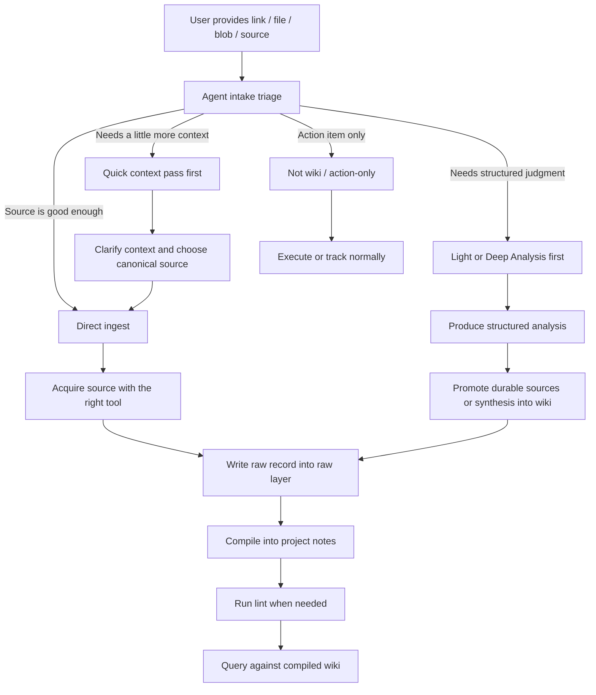

# llm-wiki

An agent skill that adapts Karpathy's LLM Knowledge Base pattern to a markdown-first knowledge base.

This repo is intentionally small. It is **not** a standalone app or framework. It is:
- a workflow/spec for how the knowledge base should operate
- a public `SKILL.md` for agent runtimes
- one useful integrity tool: `scripts/lint.py`
- reference notes for routing and compile conventions

The goal is simple: make knowledge compound over time instead of re-deriving everything from raw documents on every query.

---

## Reference

This repo is inspired by:
- Andrej Karpathy, *A pattern for building personal knowledge bases using LLMs*
- https://gist.github.com/karpathy/442a6bf555914893e9891c11519de94f

---

## Architecture

This implementation assumes a layered markdown knowledge base:

```text
L0  raw/            immutable raw sources
L1  working state   optional active/short-term layer
L2  project notes   compiled wiki: project files + dated notes
L3  durables        curated long-term notes
```

The exact filenames and surrounding runtime can vary. The important part is the separation of concerns:
- raw sources stay immutable
- compiled notes become the main reading/query surface
- lint checks integrity drift

### Runtime roles

The agent runtime plays three roles:

1. **Point of ingestion**
   - receives links, files, blobs, and source references
   - decides how to acquire the source

2. **Orchestrator**
   - chooses the right acquisition tool
   - writes the raw source record
   - compiles relevant insights into the wiki
   - runs lint when needed

3. **Query engine**
   - answers against the compiled markdown substrate using direct reads, search, project files, dated notes, and raw sources

A human-facing mirror or reader layer may be added later, but it is not required for the core architecture.

### High-level flow



---

## Operating model

There are five distinct concepts in this system.

### 1. Pre-ingest triage
Before any ingest, the agent decides the right processing depth:
- **direct ingest** when the source is already canonical enough
- **quick context pass first** when context is incomplete and the best source still needs to be identified
- **formal Light Analysis protocol first** when the topic needs structured judgment
- **formal Deep Analysis protocol first** when the topic is high-stakes or contested
- **not wiki / action-only** when the item is really just a task or reminder

Dropping a source into chat does not mean it should be ingested blindly.

### 2. Acquisition
Turn an external source into usable text, images, or extracted content.

Typical upstream tools:
- `web_fetch` for articles/docs/pages
- thread extraction tools for X / Twitter
- PDF analysis tools for PDFs
- vision tools for images/screenshots
- summarization/transcript tools for YouTube
- notebook adapters for NotebookLM notebooks

These are **acquisition tools**, not the wiki itself.

### 3. Ingest
Create a raw source record in a raw source layer such as:

```text
raw/YYYY-MM-DD-<slug>.md
```

This preserves the source material in a stable, inspectable markdown form.

### 4. Compile
Integrate the source into the persistent wiki layer:
- update relevant `project-*.md` files
- or update a dated note like `YYYY-MM-DD.md`
- add backlinks to the raw source
- flag contradictions explicitly
- update source metadata and the append-only log

### 5. Lint
Run a read-only integrity audit over the wiki:
- uncompiled raw sources
- stale compiled sources
- unresolved contradiction flags
- uncited compiled sections
- orphaned log entries
- compiled files with no backlinks

Lint is not generic workspace cleanup. It is wiki integrity work.

### 6. Query
Ask questions against the compiled memory substrate.

The answers should come from the layered markdown knowledge base, not from a separate vector product or app.

---

## What this repo includes

```text
llm-wiki/
  README.md
  SKILL.md
  pyproject.toml
  scripts/
    lint.py
  references/
    source-routing.md
    compile-conventions.md
```

### Included
- `SKILL.md` — operational protocol for ingest / compile / lint
- `scripts/lint.py` — read-only wiki integrity checker
- `references/source-routing.md` — source acquisition routing guidance
- `references/compile-conventions.md` — how to integrate raw sources into compiled notes

### Not included
- no helper ingest script
- no helper compile script
- no dedicated frontend
- no standardized query-output filing workflow yet

That is deliberate. The repo is currently a **protocol + linter**, not a full product.

---

## Why only `lint.py` remains

Earlier iterations can easily accumulate helper scripts for ingest and compile. This repo keeps only the part that is truly worth scripting.

- ingest is usually better handled directly by the agent runtime using native tools
- compile targeting is judgment-heavy and better handled by the agent directly
- linting benefits from a script because it scans many files mechanically and consistently

So the current repo keeps only the part that is clearly worth automating.

---

## Current status

- layer mapping is established
- skill behavior is documented in `SKILL.md`
- routing and compile conventions live in `references/`
- `lint.py` remains as the only script
- the workflow has been validated on canonical web and YouTube source patterns

The next meaningful milestone is continued real-world use across varied source types.

---

## Design notes vs Karpathy reference

Compared to the original LLM wiki pattern, this repo is strongest on:
- immutable raw source separation
- schema/protocol discipline
- contradiction tracking
- append-only history
- compatibility with an existing markdown memory system

It is currently weaker on:
- a first-class content catalog/index UI
- a standardized query-output filing loop
- a human browsing frontend

That is acceptable for now. The current objective is to keep the workflow sharp and well-specified before adding more surface area.

---

## Quick reference

- Skill entrypoint:
  - `SKILL.md`
- Main integrity tool:
  - `python3 scripts/lint.py`
- Supporting references:
  - `references/source-routing.md`
  - `references/compile-conventions.md`

---

## Bottom line

This repo is the operating manual for an LLM-maintained markdown knowledge base.

Humans curate sources and ask questions.
The agent acquires, compiles, cross-references, and audits.
The markdown layers become the persistent knowledge substrate.
